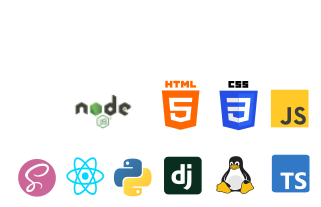

# Hi there 👋

### 🌱 I’m currently learning Python Django and Java
### 💬 Ask me about React JS and React Native as well as TypeScript and other Web/Mobile Development Things.

# My Strong Side:
### Frontend:
- **I'm good at creating anything you want to see in your website or your mobile app.**
- **Logic of your website is my responsibility.**
- **Optimizing websites for all devices.**
  
# I speak:
- *German*
- *English*
- *Russian*
- *Arabic*

# My skills:

    

